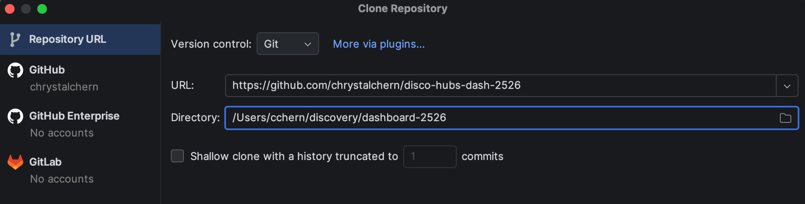
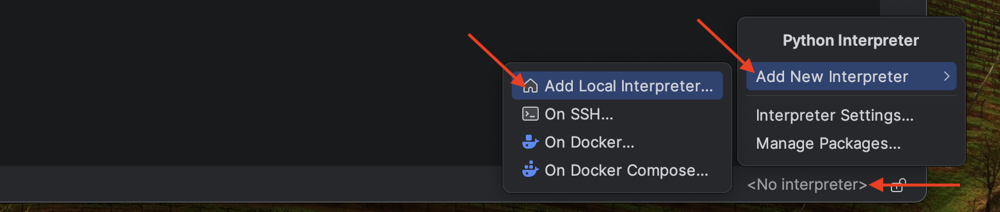
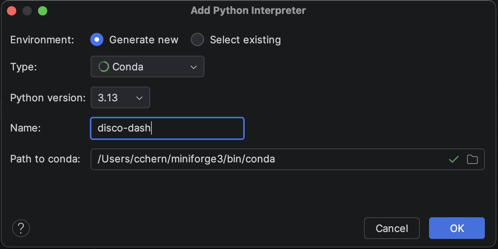

# Setting up the Project

1. Download and install PyCharm: https://www.jetbrains.com/pycharm/download/
2. Clone the project files. Upon opening PyCharm, choose "Project from Version Control...". Enter the URL: https://github.com/chrystalchern/disco-hubs-dash-2526 and choose a directory where you would like to save your project files. Select "Clone". 
3. Set up the environment. In the bottom right corner of the PyCharm window, select the Interpreter. Before setup, it should say "\<No Interpreter>". Select "Add New Interpreter", then "Add Local Interpreter..." 
4. Generate a new Conda environment with the version specified in environment.yml (for this project, use 3.13.). Give your environment a name, such as "disco-dash". The Path to conda should be automatically detected. Select "OK". 
