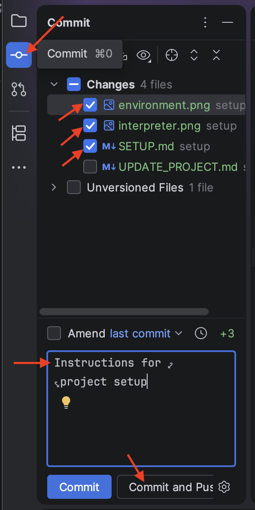

# Updating the Project

1. Set up the project using [SETUP.md](SETUP.md).
2. Run the dashboard locally using the command: `python -m streamlit run ../streamlit_app.py` (See [README.md](README.md)). The dashboard should pop up in your browser under a localhost address, e.g. http://localhost:8508/ .
3. Make a change in the code, e.g. include a new data source. See the changes reflected locally at http://localhost:XXXX/ .
4. When you are happy with a change, Commit and Push to the github repository. Locate the PyCharm commit menu (or, usually, `Ctrl+0`) and select the Changes you'd like to keep. Enter a short message describing the change, then select "Commit and Push". See the changes reflected publicly at https://disco-2526.streamlit.app/. 
5. **Reboot when changes do not show on public app**: A reboot is sometimes needed when the environment is modified; e.g., when an update is made to `environment.yml`. Sometimes, a reboot is needed for code changes. To reboot the app, the owner of the app must follow [these instructions from Streamlit](https://docs.streamlit.io/deploy/streamlit-community-cloud/manage-your-app/reboot-your-app).